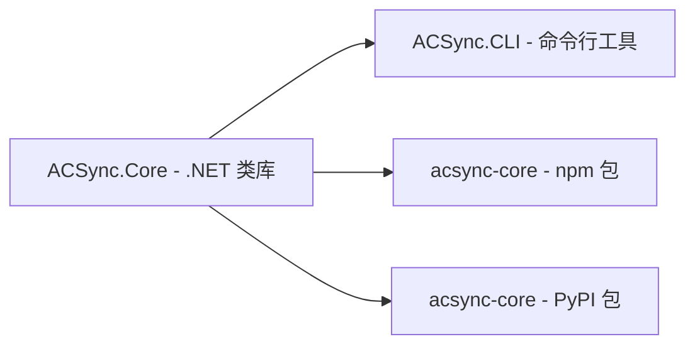

# ACSync

[English](README.md) | [简体中文](README-CN.md)

一个极其简单的增量更新/补丁系统，适用于任何二进制文件。

## 特点

- 基于 SHA256 哈希判定文件变更，确保准确性
- 多线程扫描目录，加速清单生成
- 补丁为新版本更新的差异文件，压缩为 7z 格式（LZMA2）
- 打补丁时可自动删除已废弃的旧文件
- 支持排除指定文件类型（如配置文件）
- 补丁应用成功自动删除补丁包
- AOT 兼容，低依赖

## 包

| 包 | 平台 | 安装 |
|---|---|---|
| **ACSync.CLI** | 命令行工具 | `dotnet tool install --global ACSync.CLI` |
| **ACSync.Core** | .NET 类库 | `dotnet add package ACSync.Core` |
| **acsync-core** | npm | `npm install acsync-core` |
| **acsync-core** | PyPI | `pip install acsync-core` |

各包均有详细的 API 文档：

- [ACSync.CLI](ACSync.CLI/README.md) — 命令行用法
- [ACSync.Core](ACSync.Core/README.md) — .NET 类库 API
- [acsync-core (npm)](ACSync.Npm/README.md) — Node.js API
- [acsync-core (PyPI)](ACSync.Python/README.md) — Python API

## 命令

```
创建清单：acsync <path> -l
更新：    acsync <path> -u [-e ext1,ext2,...]
创建补丁：acsync <oldpath> <newpath> -m
```

## 详细说明

### 创建清单 `-l`

扫描指定目录的全部文件，生成 `acsync_manifest.json`。

清单内容包含每个文件的：

| 字段 | 说明 |
|---|---|
| `relativePath` | 相对路径（Unix 分隔符） |
| `lastWriteTimeUtc` | 最后修改时间 (UTC) |
| `length` | 文件大小（字节） |
| `sha256` | SHA256 哈希值 |

清单生成采用多线程并行计算 SHA256，适合大型目录。

### 创建补丁 `-m`

比对旧版本清单与新版本目录（若新版本目录已有 `acsync_manifest.json` 则直接加载，避免重复扫描），将差异文件打包为 `acsync_patch.7z`。

- 新增/变更的文件打包进 7z
- 被删除的文件路径写入 `acsync_delete.txt` 一并打包
- 新版本清单也打包进补丁，便于更新后同步

### 更新 `-u`

解压 `acsync_patch.7z` 到目标目录，覆盖对应文件。

- 自动读取补丁内的 `acsync_delete.txt`，删除已废弃的文件
- 支持 `-e` / `--exclude` 参数跳过指定扩展名的文件（例如 `-e .json,.ini,.yaml` 保留配置文件不被覆盖）
- 更新完成后自动删除 `acsync_patch.7z`

## 流程示例

```bash
# 1. 旧版本目录创建清单
acsync D:\app\v1.0 -l

# 2. 新版本目录创建清单
acsync D:\app\v2.0 -l

# 3. 基于两份清单创建补丁
acsync D:\app\v1.0 D:\app\v2.0 -m

# 4. 将补丁应用到用户目录（排除配置文件）
acsync D:\app\user -u -e .json,.ini,.yaml
```

## 生态系统


