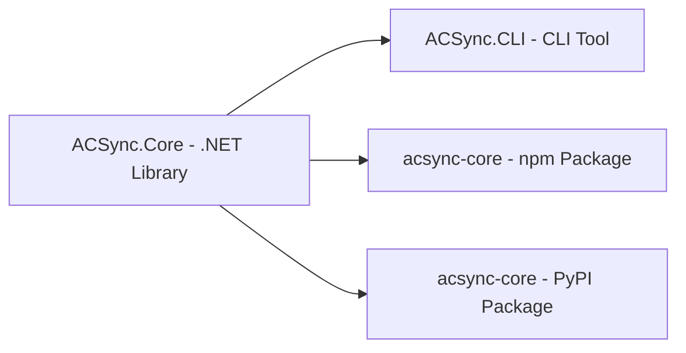

# ACSync

[English](README.md) | [简体中文](README-CN.md)

An extremely simple incremental update/patch system for any binary files.

[](https://deepwiki.com/G-POPLO/ACSync)
## Features

- SHA256-based file comparison for reliable change detection
- Multi-threaded directory scanning for fast manifest generation
- Patch is a 7z archive (LZMA2) containing only the delta files
- Delete obsolete files during update
- Exclude specific file types from update (e.g. config files)
- Auto-delete patch file on successful update
- AOT compatible, minimal dependencies

## Packages

| Package | Platform | Install |
|---|---|---|
| **ACSync.CLI** | CLI tool | `dotnet tool install --global ACSync.CLI` |
| **ACSync.Core** | .NET library | `dotnet add package ACSync.Core` |
| **acsync-core** | npm | `npm install acsync-core` |
| **acsync-core** | PyPI | `pip install acsync-core` |

Each package has its own README with detailed API documentation:

- [ACSync.CLI](ACSync.CLI/README.md) — CLI usage
- [ACSync.Core](ACSync.Core/README.md) — .NET library API
- [acsync-core (npm)](ACSync.Npm/README.md) — Node.js API
- [acsync-core (PyPI)](ACSync.Python/README.md) — Python API

## CLI Usage

```
acsync <path> -l                  Create manifest
acsync <path> -u [-e ext1,ext2]   Apply patch
acsync <oldpath> <newpath> -m     Create patch
```

### Create manifest `-l`

Scans the directory and generates `acsync_manifest.json` with SHA256 hashes for all files.

| Field | Description |
|---|---|
| `relativePath` | Relative path (Unix separators) |
| `lastWriteTimeUtc` | Last write time (UTC) |
| `length` | File size (bytes) |
| `sha256` | SHA256 hash |

### Create patch `-m`

Compares the old manifest with the new directory and packages the delta as `acsync_patch.7z`.

- If the new directory already has a manifest, it is loaded directly (no rescan)
- Added/changed files are packed into the 7z
- Deleted file paths are written to `acsync_delete.txt` and included in the patch
- New manifest is also bundled for post-update sync

### Apply patch `-u`

Extracts `acsync_patch.7z` into the target directory.

- Automatically reads `acsync_delete.txt` and removes obsolete files
- Supports `-e` / `--exclude` to skip file types: `-e .json,.ini,.yaml`
- Patch file is deleted automatically on success

## Usage Example

```bash
# 1. Create manifest for old version
acsync D:\app\v1.0 -l

# 2. Create manifest for new version
acsync D:\app\v2.0 -l

# 3. Create patch based on both manifests
acsync D:\app\v1.0 D:\app\v2.0 -m

# 4. Apply patch to user directory (exclude config files)
acsync D:\app\user -u -e .json,.ini,.yaml
```

## Ecosystem


